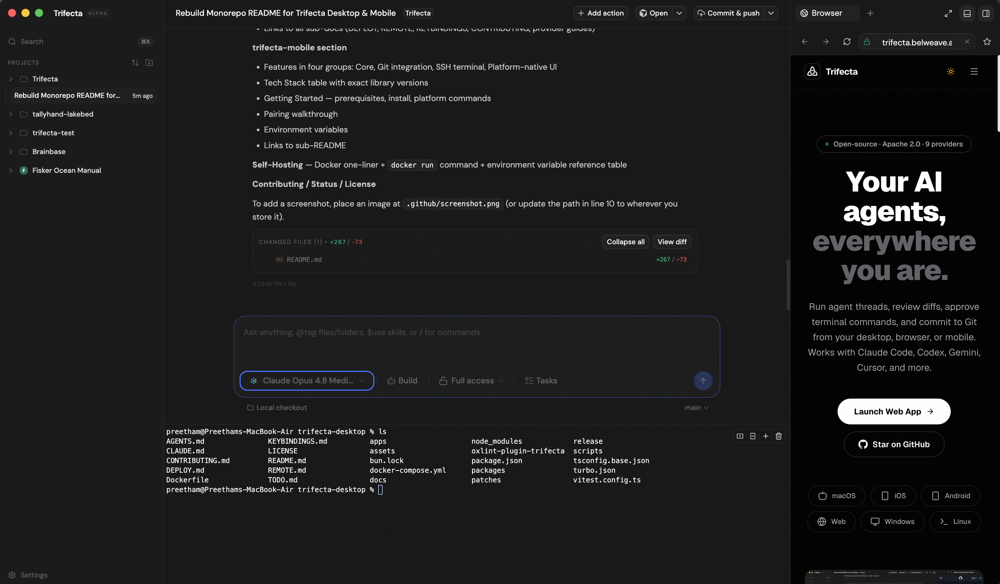

# Trifecta [](https://socket.dev/npm/package/@belweave/trifecta)

> One interface for every AI coding agent — on every device you own.

**Made by [Belweave](https://belweave.ai) · Built on [T3 Code](https://t3.codes)**

---

<!-- Screenshot -->


---

## What is Trifecta?

Trifecta is a cross-platform AI coding agent platform. You bring your own agents (Codex, Claude Code, OpenCode, Gemini, Cursor, Devin, and more) — Trifecta wraps them all behind a single, consistent interface and streams structured events to any connected client in real time.

**The problem it solves:** Modern developers juggle several AI coding agents simultaneously, each with its own CLI, authentication system, and UI. Trifecta eliminates that context switching with a unified session model, shared Git/SSH tooling, and clients that reach every device you work from — desktop, browser, iOS, Android, and your editor.

```
  Clients     iOS · Android · VS Code/Cursor · Web UI
                            │
                 WebSocket · Effect-style RPC
                            ▼
  Server      @belweave/trifecta — Node.js, Effect-TS
              WebSocket gateway · provider registry · Git · SSH
                            │
               stdio:  JSON-RPC / ACP
                            ▼
  Agents      Codex · Claude · OpenCode · Gemini · Antigravity
              Cursor · Hermes · Devin · ACP Registry
```

---

## Quick Start

```bash
# No install required — runs the server and prints a pairing URL + QR code
npx @belweave/trifecta
```

Open the pairing URL in any Trifecta client to connect. For the desktop app, grab the latest installer from [GitHub Releases](https://github.com/pkyanam/trifecta/releases).

---

## Repository Layout

| Path | Description |
|------|-------------|
| [`trifecta-desktop/`](./trifecta-desktop) | Core platform — server, web UI, Electron app, VS Code extension, shared packages |
| [`trifecta-mobile/`](./trifecta-mobile) | Cross-platform mobile + web client (Expo, React Native) |
| [`server/`](./server) | Pre-built server bundle + systemd unit for self-hosting |
| [`docs/`](./docs) | Architecture notes |
| [`_reference/`](./_reference) | Read-only reference checkouts |

---

## trifecta-desktop

The core of the platform. A single Turborepo + Bun monorepo containing the Node.js server, the React web UI it serves, an Electron desktop app, and a VS Code/Cursor extension. Every client — desktop, browser, mobile, editor — speaks the same WebSocket protocol to this server.

### Supported Agents

| Agent | Protocol | Setup |
|-------|----------|-------|
| **Codex** | JSON-RPC (stdio) | `codex login` |
| **Claude Code** | JSON-RPC (stdio) | `claude auth login` |
| **OpenCode** | JSON-RPC (stdio) | `opencode auth login` |
| **Gemini** | Headless CLI | `npm i -g @google/gemini-cli` |
| **Antigravity** | Python SDK / CLI | `google-antigravity` SDK or `agy` CLI |
| **Cursor** | ACP (stdio) | bundled `cursor-agent` _(Early Access)_ |
| **Hermes** | ACP (stdio) | `hermes setup` |
| **Devin** | ACP (stdio) | `devin acp` |
| **ACP Registry** | ACP (stdio) | any [ACP](https://agentclientprotocol.com)-compatible agent |

Trifecta is **bring-your-own-agent** — it drives agents you already have installed and authenticated. Set up at least one before pairing a client.

### Workspace

**Apps**

| Package | Path | Description |
|---------|------|-------------|
| `@belweave/trifecta` | `apps/server` | Agent-orchestration server — Effect-TS, WebSocket RPC, provider registry, Git, SSH |
| `@belweave/web` | `apps/web` | Web UI — React 19, Vite 8, Tailwind CSS 4, Zustand, Lexical, xterm.js |
| `@belweave/desktop` | `apps/desktop` | Electron 41 shell with auto-updater and network-access management |
| `trifecta-ide` | `apps/vscode` | VS Code / Cursor extension — sidebar chat panel |
| `@belweave/marketing` | `apps/marketing` | In-repo marketing site (Astro) |

**Packages**

| Package | Path | Description |
|---------|------|-------------|
| `@belweave/contracts` | `packages/contracts` | Effect Schema contracts — events, RPC, models, settings (schema only, no runtime logic) |
| `@belweave/shared` | `packages/shared` | Shared runtime utilities with explicit subpath exports (e.g. `@belweave/shared/git`) |
| `@belweave/client-runtime` | `packages/client-runtime` | Client-side WebSocket / RPC runtime |
| `@belweave/ssh` | `packages/ssh` | SSH terminal and tunnel helpers |
| `@belweave/tailscale` | `packages/tailscale` | Tailscale endpoint discovery and Serve integration |
| `effect-acp` | `packages/effect-acp` | Effect bindings for the Agent Client Protocol |
| `effect-codex-app-server` | `packages/effect-codex-app-server` | Effect bindings for the Codex app-server protocol |

### Features

**Agent orchestration**
- Unified session model across all nine providers — create, resume, and switch threads without leaving the UI
- Per-provider instance configuration: display name, binary path, `CODEX_HOME` / `Claude HOME`, environment variables, sensitive secrets
- Multiple accounts per provider (e.g., separate work and personal Codex or Claude setups)
- Full Access mode (autonomous) and Supervised mode (approval-gated) per session

**Git & source control**
- Live branch and diff status with checkpoint commits on every turn
- Create pull requests and merge requests from inside the UI
- Clone repositories and publish local projects directly to GitHub, GitLab, Bitbucket, or Azure DevOps
- Git worktree manager for parallel multi-branch development

**Terminal & editor**
- Integrated terminal drawer backed by xterm.js — split, new, and close panes with keyboard shortcuts
- Diff panel for file-level visualization of agent changes
- File attachment support for sending context to agents
- Command palette (`Cmd/Ctrl+K`) for every action

**Remote access**
- QR code and URL pairing for one-time device onboarding; session-based auth thereafter
- LAN, Tailscale (Tailnet IP + MagicDNS), and HTTPS endpoint discovery — automatic endpoint switching
- Tailscale Serve integration for clean `*.tailnet.ts.net` HTTPS endpoints
- Desktop-managed SSH launch: the app probes a remote host, starts or reuses a remote Trifecta server, and opens a local port forward automatically
- Hosted web app at `https://app.trifecta.belweave.ai` for HTTPS-accessible backends

**Customization**
- Keybindings via `~/.belweave/keybindings.json` — fully rebindable with `when` context expressions
- Provider accent colors and display names for at-a-glance account differentiation

### Tech Stack

| Layer | Technology |
|-------|------------|
| Runtime | Electron 41 (desktop), Node.js ≥22.16 (server) |
| Effect system | Effect-TS 4.0 |
| Build | Turborepo 2.9, tsdown, Vite 8 |
| Web UI | React 19, Tailwind CSS 4, Zustand 5, Lexical, TanStack Router + Query |
| Lint / format | oxlint + oxfmt (Oxc toolchain) |
| Agent protocols | JSON-RPC over stdio, ACP over stdio, Headless CLI |
| Database | SQLite via `@effect/sql-sqlite-bun` |

### Development

```bash
cd trifecta-desktop
bun install

bun run dev            # server + web UI (http://localhost:3773)
bun run dev:desktop    # Electron shell
```

```bash
# Quality gates (all must pass before committing)
bun run typecheck
bun run lint
bun run fmt

# Tests
bun run test

# Scoped builds
bun run build --filter=@belweave/trifecta --filter=@belweave/web
```

### More docs

- [DEPLOY.md](./trifecta-desktop/DEPLOY.md) — AWS EC2 / Docker deployment walkthrough
- [REMOTE.md](./trifecta-desktop/REMOTE.md) — remote access, Tailscale, and SSH launch
- [KEYBINDINGS.md](./trifecta-desktop/KEYBINDINGS.md) — keybinding reference
- [CONTRIBUTING.md](./trifecta-desktop/CONTRIBUTING.md) — contribution guidelines
- [docs/providers/](./trifecta-desktop/docs/providers/) — per-provider multi-account setup guides
- [docs/source-control-providers.md](./trifecta-desktop/docs/source-control-providers.md) — GitHub, GitLab, Bitbucket, Azure DevOps

---

## trifecta-mobile

A cross-platform iOS, Android, and web client built with Expo and React Native. Pairs with any running Trifecta server — local, LAN, Tailscale, or cloud — and gives you the same AI chat, Git actions, and SSH terminal from your phone or tablet.

### Features

**Core**
- **Server pairing** — one-time token exchange stores a persistent session in the device keychain; paste a pairing URL to auto-fill everything
- **Streaming AI chat** — throttled 30 fps token rendering, full Markdown (GFM tables, fenced code blocks, inline formatting), shimmer loading states
- **Multi-provider model picker** — searchable provider rail and model list sourced live from the server, with per-thread model selection
- **Project & thread management** — real-time subscription to projects and threads, sorted by recency
- **WebSocket RPC** — bidirectional connection with exponential-backoff reconnection (1 s → 30 s), 5 s heartbeat, 30 s request timeout

**Git integration**
- Live branch and diff status in the conversation header
- Stacked one-tap Git actions: commit, push, pull, commit+push, commit+push+PR
- Worktree manager for multi-branch workflows
- Protected branch detection and PR status tracking

**SSH terminal**
- Manage SSH hosts with biometric-authenticated access
- Multiple auth methods: agent-forward, keychain key, interactive password prompt
- Host key fingerprint verification
- Full terminal session management

**Platform-native UI**
- **iOS 26**: Liquid Glass glassmorphic prompt composer and toolbar via `expo-glass-effect`
- **iOS**: SwiftUI model picker, SF Symbols, haptic feedback, native menus
- **Android**: Material-style header, custom gesture grabber
- **Web**: Radix UI context menus, collapsible sidebar
- Platform-adaptive layouts — gesture-driven drawer on iOS/Android, sidebar on web
- Automatic light/dark theme using OKLCH design tokens in Tailwind CSS v4

### Tech Stack

| Layer | Technology |
|-------|------------|
| Framework | Expo SDK 56, React Native 0.85.3, React 19 |
| Navigation | Expo Router (file-based, typed routes) |
| Styling | Tailwind CSS v4 via [Uniwind](https://uniwind.dev/), OKLCH design tokens |
| Native UI | `@expo/ui` (SwiftUI), `expo-symbols`, `expo-haptics`, `expo-glass-effect` |
| Web UI | Radix UI (context menu, dropdown, tooltip), Lucide icons |
| Chat list | `@legendapp/list` — virtualized with Reanimated scroll-to-bottom |
| Animations | `react-native-reanimated` 4, `react-native-gesture-handler` |
| Graphics | `@shopify/react-native-skia` — Liquid Metal animated shader buttons |
| Markdown | Custom AST renderer (`mdast-util-from-markdown`) + `react-syntax-highlighter` |
| Storage | `expo-secure-store` (keychain), `expo-local-authentication` (biometrics) |

### Getting Started

> Trifecta Mobile requires a **custom Expo development build**. It does not work in Expo Go.

**Prerequisites**

- [Bun](https://bun.sh) and the Expo CLI
- A running Trifecta server: `npx @belweave/trifecta`
- For iOS: Xcode with a simulator or physical device

```bash
cd trifecta-mobile
bun install

bun start              # interactive platform menu
bun run ios            # iOS simulator
bun run android        # Android emulator
bun run web            # browser
```

**Pairing with the server**

1. Start the server on your desktop: `npx @belweave/trifecta`
2. Open the app — you'll be prompted to pair on first launch
3. Copy the pairing URL printed by the server and tap **Paste link** in the app to auto-fill, or enter the server URL and token manually
4. Tap **Connect** — credentials are stored securely in the device keychain

> HTTPS and Cloudflare Tunnel URLs work — the app upgrades to WSS automatically. For LAN connections, use Tailscale or stay on the same network.

**Environment variables**

```bash
cp .env.example .env
```

The only variable currently required is `EXPO_UNSTABLE_DEPLOY_SERVER=1` for the Expo server-side web output.

### Quality checks

```bash
bun run typecheck
bun run lint
```

### More docs

- [trifecta-mobile/README.md](./trifecta-mobile/README.md) — full mobile README
- Privacy Policy: https://trifecta.belweave.ai/privacy
- Terms: https://trifecta.belweave.ai/terms-and-conditions

---

## Self-Hosting

**Docker (quickest path):**

```bash
docker build --platform=linux/amd64 --build-arg INSTALL_CODEX=true \
  -t trifecta-server ./trifecta-desktop

docker run -d --name trifecta --restart unless-stopped \
  -p 3773:3773 \
  -v /opt/trifecta/data:/data \
  -v /home/ubuntu/.codex:/home/trifecta/.codex \
  -e TRIFECTA_HOST=0.0.0.0 \
  -e TRIFECTA_PORT=3773 \
  -e TRIFECTA_HOME=/data \
  trifecta-server
```

**Environment variables:**

| Variable | Default | Description |
|----------|---------|-------------|
| `TRIFECTA_HOST` | `0.0.0.0` | Interface to bind |
| `TRIFECTA_PORT` | `3773` | HTTP + WebSocket port |
| `TRIFECTA_HOME` | `/data` | Persistent data directory |
| `TRIFECTA_LOG_LEVEL` | `Info` | `Debug` / `Info` / `Warning` / `Error` |
| `CODEX_HOME` | — | Codex auth/config directory |
| `OPENAI_API_KEY` | — | Codex API key (alternative to `codex login`) |

See [trifecta-desktop/DEPLOY.md](./trifecta-desktop/DEPLOY.md) for the full AWS EC2 walkthrough.

---

## Contributing

We welcome contributions. Please read [CONTRIBUTING.md](./trifecta-desktop/CONTRIBUTING.md) before opening an issue or PR.

Questions? Open an [issue](https://github.com/pkyanam/trifecta/issues), join the [Discord](https://discord.gg/jn4EGJjrvv), or email info@belweave.com.

---

## Status

Trifecta is early and moving fast — expect rough edges and breaking changes between alpha releases.

---

## License

Copyright © Belweave. All rights reserved.
